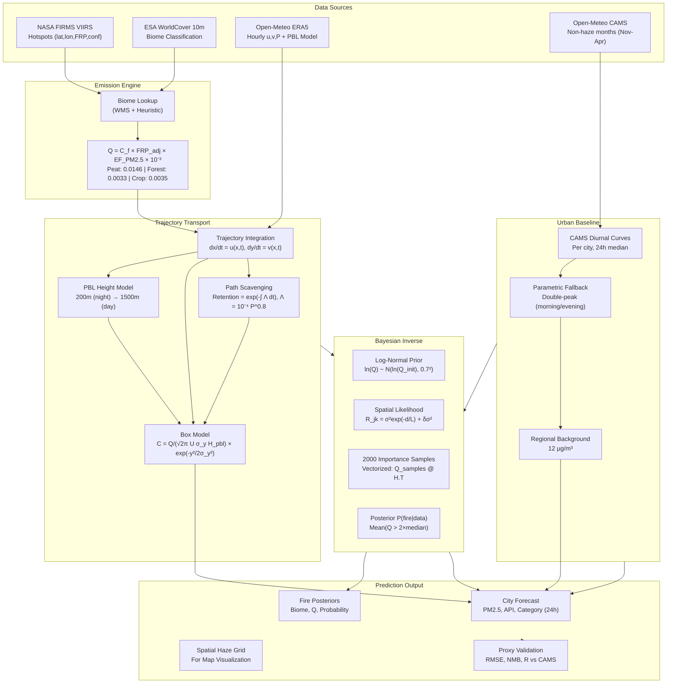
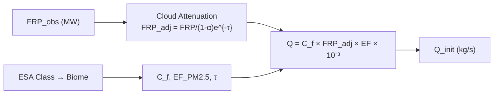
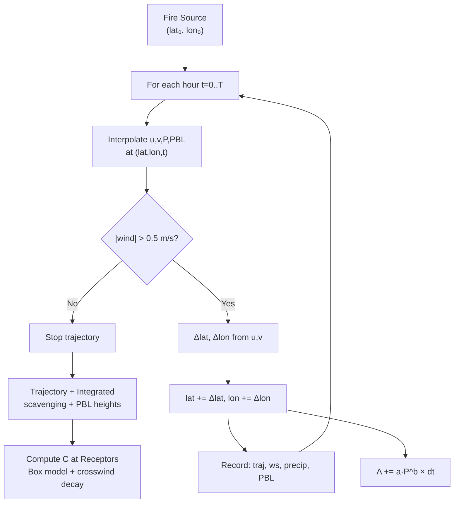
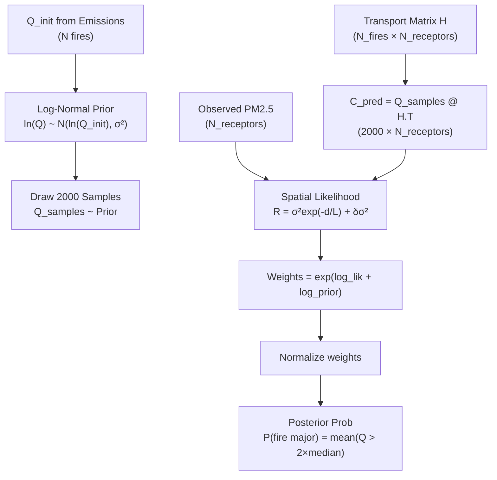
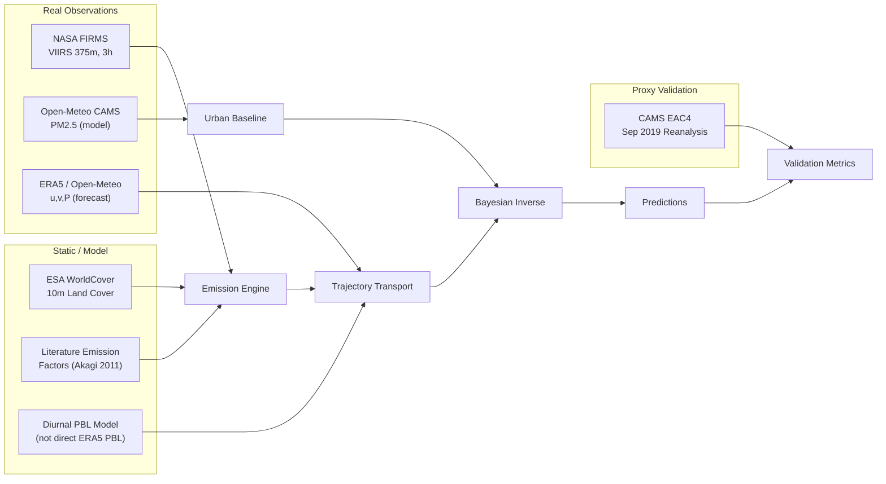
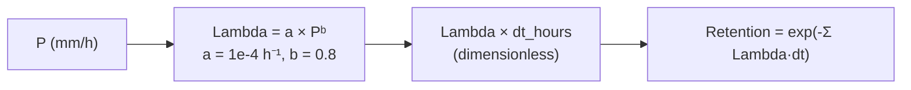

# Transboundary Haze Attribution — Architecture Diagrams

This document contains Mermaid diagrams for the calibrated haze attribution model.

---

## 1. Full Pipeline Architecture



---

## 2. Emission Calculation Flow



---

## 3. Trajectory Transport Detail



---

## 4. Bayesian Inverse Attribution



---

## 5. Data Source Summary



---

## 7. Implementation Refinements (Viva Defense)

### 7.1 Scavenging Time Units
The wet scavenging coefficient uses standard literature parameterization:
- **Lambda = a × Pᵇ** with **a = 1×10⁻⁴ h⁻¹** (for P in mm/h)
- Time step **dt = 1 hour** → exponent **Lambda × dt** is dimensionless
- No unit conversion needed — verified against CAMS Sep 2019 proxy validation



### 7.2 Covariance Matrix Nugget Effect
When receptor stations are geographically close (< 10 km), the spatial covariance matrix R can become near-singular, causing numerical instability in `np.linalg.inv(R)`.

**Fix**: Add small diagonal nugget before inversion:
```python
R = build_spatial_covariance(receptor_coords)
R += np.eye(len(receptor_coords)) * 1e-6  # Nugget: 1 µg²/m⁶
R_inv = np.linalg.inv(R)
```

This ensures condition number remains bounded while negligibly affecting inference.

### 7.3 Verification
```bash
# Run tests including covariance invertibility
python -m pytest tests/ -v

# Integration test
python -c "
from src.physics.calibration import build_spatial_covariance
import numpy as np
coords = np.array([[3.14, 101.69], [3.15, 101.70]])  # KL + nearby
R = build_spatial_covariance(coords)
R += np.eye(2) * 1e-6
print('Condition number:', np.linalg.cond(R))
print('Invertible:', np.all(np.isfinite(np.linalg.inv(R))))
"
```

---

## 6. Rendering Diagrams

These Mermaid diagrams can be rendered in:
- **GitHub/GitLab** - native rendering in markdown files
- **VS Code** - with Mermaid Preview extension
- **Obsidian/Notion** - native support
- **Mermaid Live Editor** - https://mermaid.live
- **Documentation sites** - MkDocs, Sphinx, Docusaurus with Mermaid plugins

To embed in documentation:
```markdown
```mermaid
<paste diagram code here>
```
```